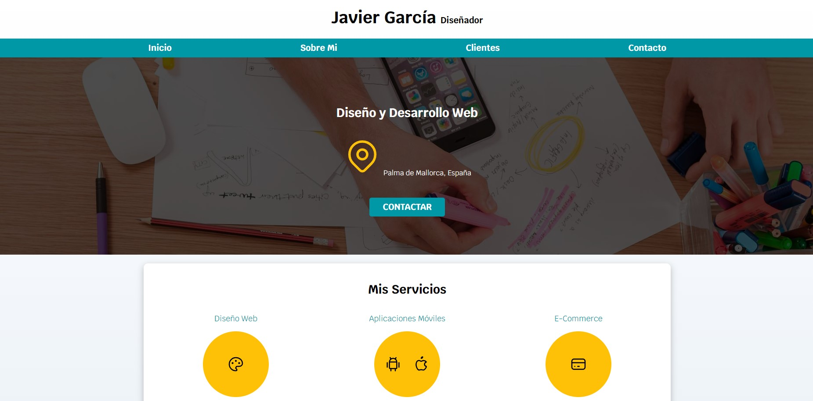

# 
# Freelancer Web

Diseño básico y minimalista sobre un diseñador freelance

## Demo



[https://jgarciaprojects-freelancerweb.netlify.app](https://jgarciaprojects-freelancerweb.netlify.app)
## Tecnologias Usadas

**Client:** HTML, CSS

## Instalación

Primero trendrás que clonar el proyecto:

```bash
  git clone https://github.com/jgarciah-esliceu/Freelancer-Web.git
```
Luego deberas ejecutar los siguientes comandos en la carpeta del proyecto:

- Puedes instalar la extension LiveServer en VSCode para ver el proyecto en vivo.
